# 智读 (ZhiDu) - 函数调用关系图

本文档展示了智读应用的函数调用关系，从main入口开始，通过调用关系或功能操作关系连接各个类和函数。

## 应用启动流程

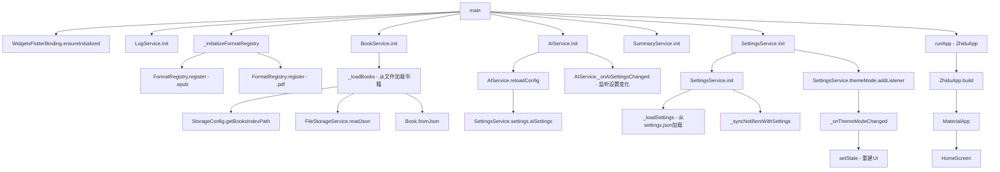

## 完整的启动调用链

```mermaid
graph TD
    A[main] --> B[WidgetsFlutterBinding.ensureInitialized]
    A --> C[LogService.init]
    A --> D[_initializeFormatRegistry]
    A --> E[BookService.init]
    A --> F[AIService.init]
    A --> G[SummaryService.init]
    A --> H[SettingsService.init]
    A --> I[runApp - ZhiduApp]
    
    C --> J[LogService._init - 初始化日志系统]
    D --> K[FormatRegistry.register - EPUB解析器]
    D --> L[FormatRegistry.register - PDF解析器]
    
    E --> M[BookService._loadBooks - 加载书籍索引]
    M --> N[StorageConfig.getBooksIndexPath - 获取索引路径]
    M --> O[FileStorageService.readJson - 读取索引文件]
    M --> P[Book.fromJson - 解析书籍数据]
    
    F --> Q[AIService.reloadConfig - 从SettingsService加载AI配置]
    Q --> R[SettingsService().settings.aiSettings - 获取AI设置]
    
    H --> S[SettingsService._loadSettings - 加载应用设置]
    S --> T[getApplicationDocumentsDirectory - 获取文档目录]
    S --> U[File - 读取settings.json]
    S --> V[_syncNotifiersWithSettings - 同步ValueNotifiers]
    
    I --> W[ZhiduApp.build - 构建应用UI]
    W --> X[MaterialApp - Flutter应用容器]
    X --> Y[HomeScreen - 首页]
```

## UI层调用关系

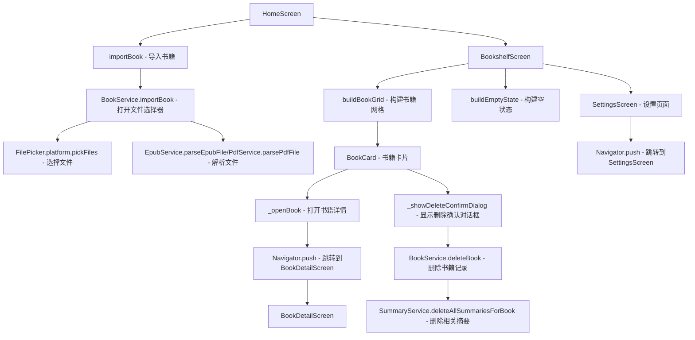

## UI到服务的调用模式

```mermaid
graph TD
    A[UI Screens] --> B[Service Singleton Access]
    A --> C[ValueNotifier Reactive Pattern]
    
    B --> D[BookService - 书籍管理]
    B --> E[AIService - AI服务]
    B --> F[SummaryService - 摘要服务]
    B --> G[SettingsService - 设置服务]
    
    C --> H[SettingsService.themeMode.addListener]
    C --> I[SettingsService.aiSettings.addListener]
    C --> J[ListenableBuilder - 响应式UI更新]
    
    D --> K[BookService.getBookById]
    D --> L[BookService.importBook]
    D --> M[BookService.deleteBook]
    
    E --> N[AIService.generateFullChapterSummary]
    E --> O[AIService.generateBookSummaryFromPreface]
    E --> P[AIService.testConnection]
    
    F --> Q[SummaryService.generateSummariesForBook]
    F --> R[SummaryService.getSummary]
    F --> S[SummaryService.deleteAllSummariesForBook]
    
    G --> T[SettingsService.updateAiSettings]
    G --> U[SettingsService.setThemeMode]
    G --> V[SettingsService.updateLanguageSettings]
```

## 服务层调用关系

```mermaid
graph TD
    A[BookService] --> B[BookService.init - 初始化]
    A --> C[BookService.importBookFromPath - 从路径导入]
    A --> D[BookService.importBook - 导入书籍]
    A --> E[BookService.getBookById - 获取书籍]
    A --> F[BookService.deleteBook - 删除书籍]
    A --> G[BookService.updateBook - 更新书籍]
    A --> H[BookService.searchBooks - 搜索书籍]
    
    B --> I[_loadBooks - 加载书籍列表]
    C --> J[EpubService.parseEpubFile - 解析EPUB]
    C --> K[PdfService.parsePdfFile - 解析PDF]
    C --> L[_saveBooksIndex - 保存索引]
    C --> M[_saveBookMetadata - 保存元数据]
    
    D --> E
    D --> C
    
    A --> N[FormatRegistry.getParser - 获取解析器]
    N --> O[EpubParser/PdfParser - 具体解析器]
    
    P[AIService] --> Q[AIService.init - 初始化]
    P --> R[AIService.generateFullChapterSummary - 生成章节摘要]
    P --> S[AIService.generateBookSummaryFromPreface - 从前言生成书籍摘要]
    P --> T[AIService.generateBookSummary - 生成书籍摘要]
    P --> U[AIService._callAI - 调用AI API]
    
    Q --> V[AIService.reloadConfig - 重新加载配置]
    V --> W[SettingsService.settings.aiSettings - 从设置获取AI配置]
    
    R --> U
    S --> U
    T --> U
    U --> X[http.Client.post - HTTP请求AI API]
    
    Y[SummaryService] --> Z[SummaryService.init - 初始化]
    Y --> AA[SummaryService.generateSummariesForBook - 生成书籍所有摘要]
    Y --> AB[SummaryService.generateSummary - 生成单个摘要]
    Y --> AC[SummaryService.getSummary - 获取摘要]
    Y --> AD[SummaryService.deleteAllSummariesForBook - 删除书籍所有摘要]
    
    AA --> AE[FormatRegistry.getParser.getChapters - 获取章节列表]
    AA --> AF[SummaryService.generateSummary - 为每个章节生成摘要]
    AB --> AG[AIService.generateFullChapterSummary - 调用AI生成摘要]
```

## 服务间通信模式

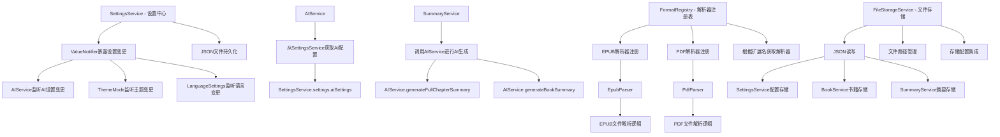

## 完整调用链路图

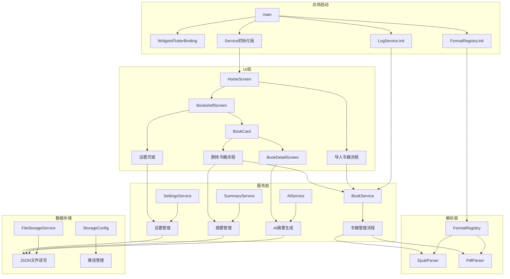

## 异步流程和并发控制

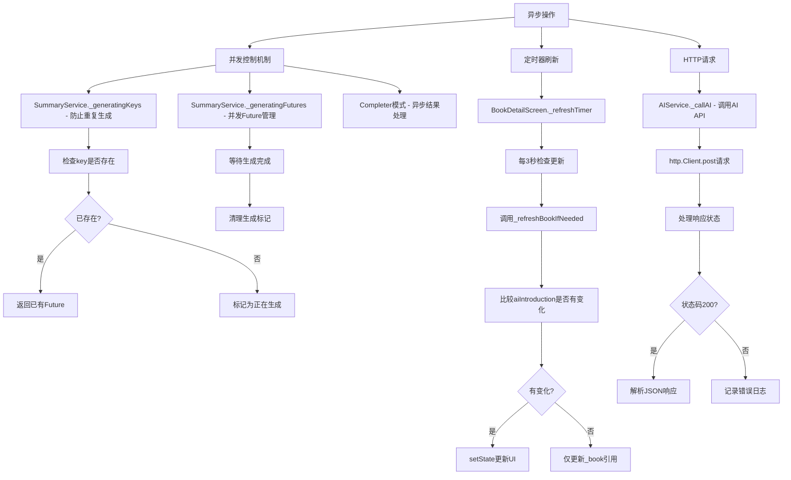

## 事件驱动流程

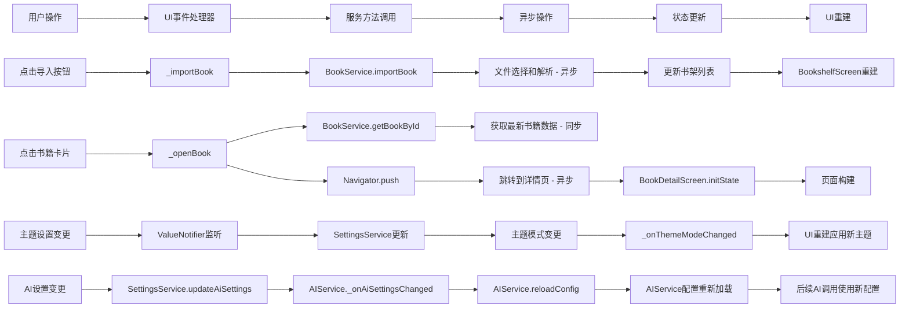

## 生命周期关系

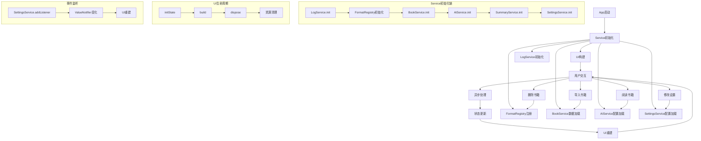

## 数据流向图

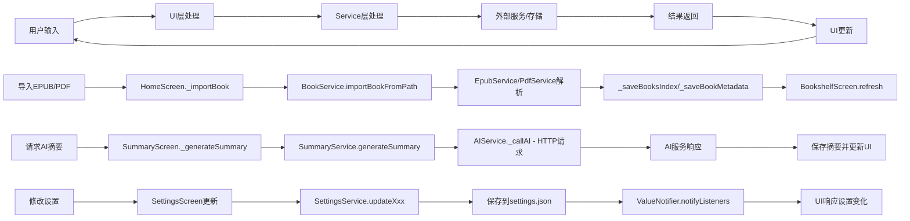

## 架构模式分析

### 单例模式 (Singleton Pattern)

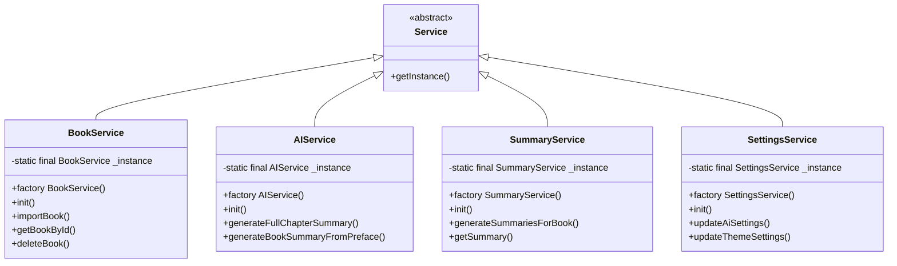

### 注册表模式 (Registry Pattern)

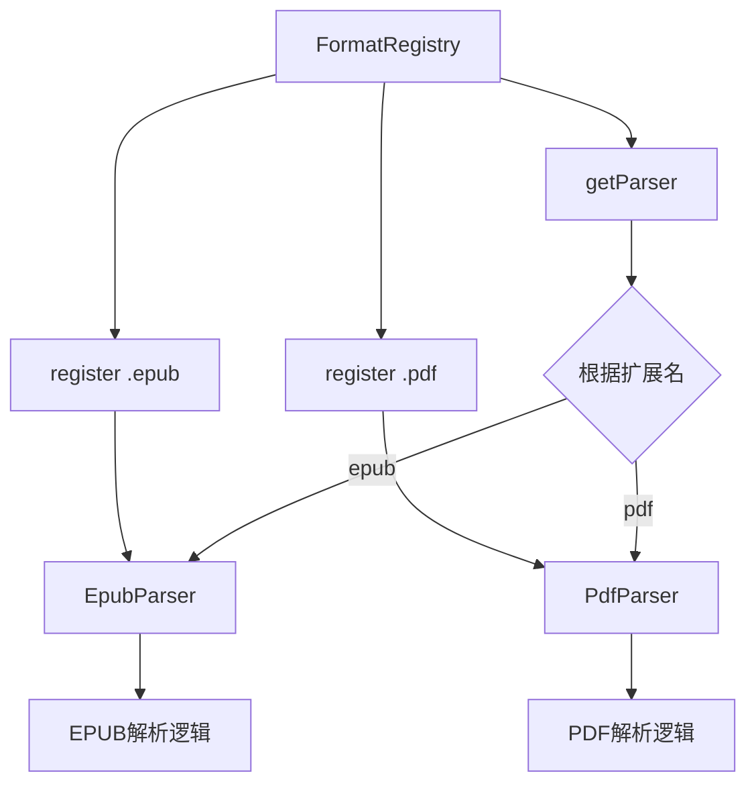

### 响应式模式 (Reactive Pattern)

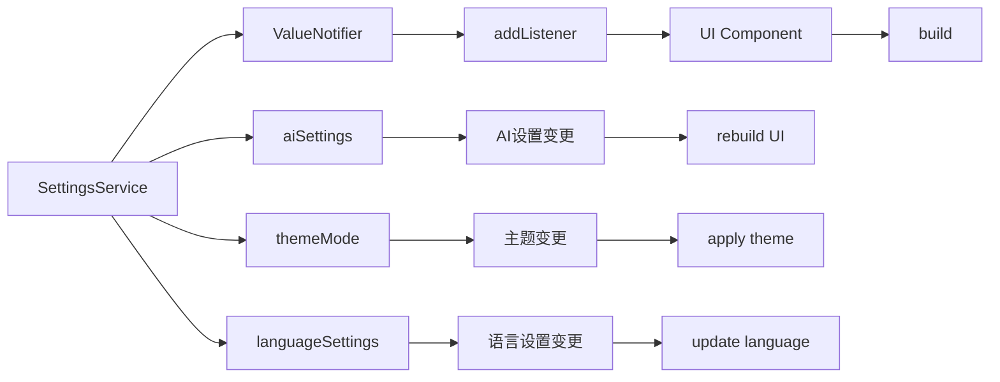

## 重要注意事项

在使用 LanguageSettings 时，请注意测试文件中的错误引用：

- **错误的属性引用**: 测试文件中存在对 `manualLanguage` 属性的错误引用
- **正确的属性**: 应当使用 `aiOutputLanguage` 属性来获取AI输出语言设置
- **修复方式**: 将测试文件中的 `manualLanguage` 替换为 `aiOutputLanguage`

### 正确的使用方式

```dart
// 正确的方式：使用 aiOutputLanguage 属性
final langSettings = SettingsService().settings.languageSettings;
if (langSettings.aiLanguageMode == 'manual') {
  final languageCode = langSettings.aiOutputLanguage;
  // 使用 languageCode
}

// 错误的方式：不存在 manualLanguage 属性
// final languageCode = langSettings.manualLanguage; // 编译错误
```

### 架构总结

智读应用采用了分层服务导向架构，具有清晰的关注点分离：

1. **单例模式**: 所有服务使用单例模式进行全局状态管理
2. **注册表模式**: FormatRegistry实现多格式解析的多态调度
3. **响应式模式**: SettingsService通过ValueNotifiers实现实时UI更新
4. **并发控制**: SummaryService使用_generatingKeys和_generatingFutures防止重复请求
5. **异步处理**: 所有I/O操作（文件解析、AI API调用、存储）均为异步并有适当的错误处理
```