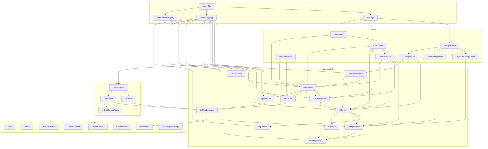
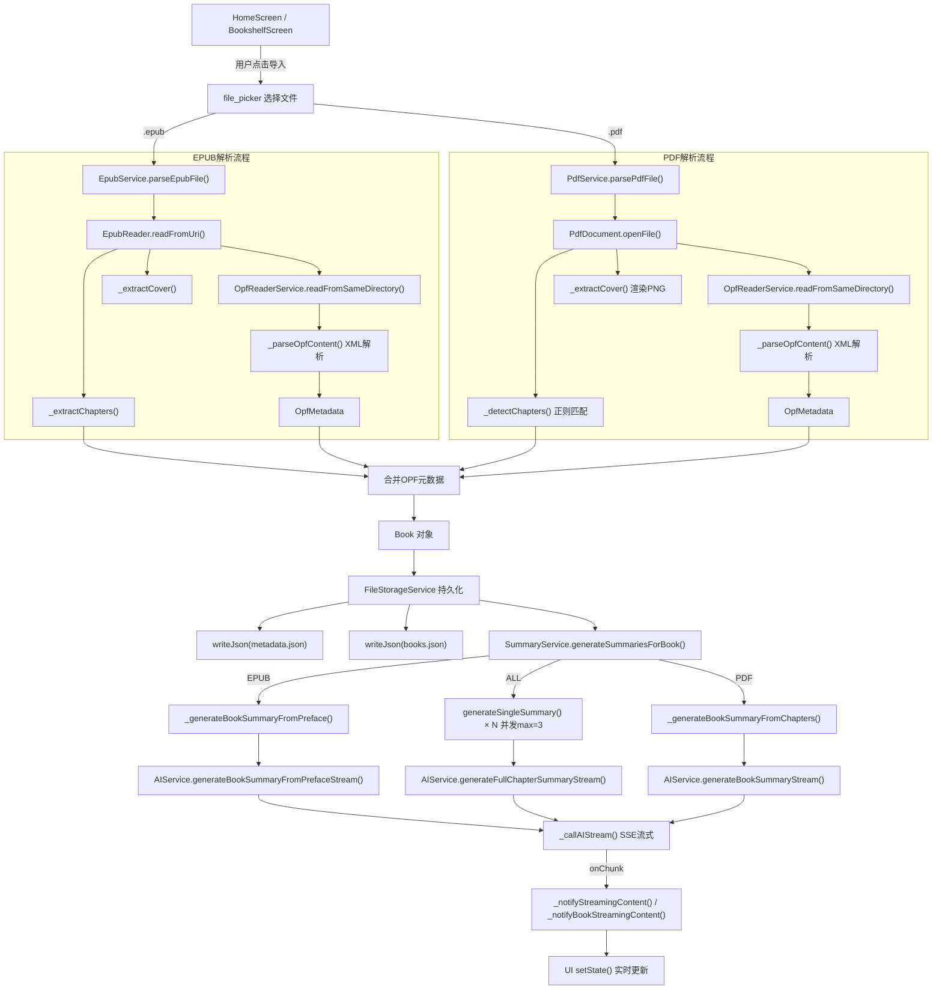
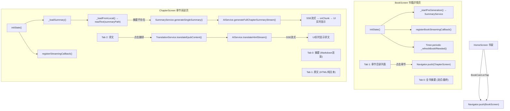
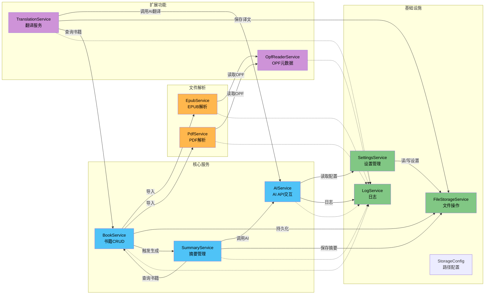
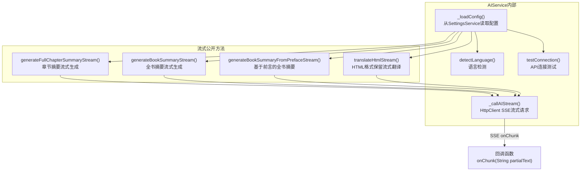
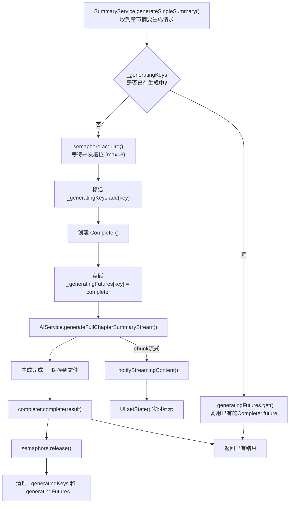
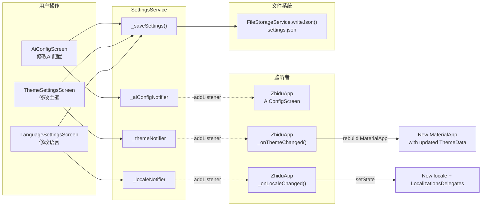
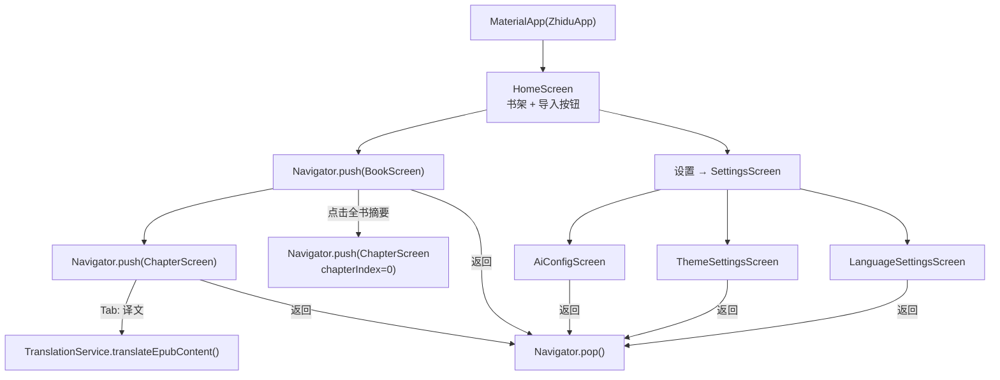
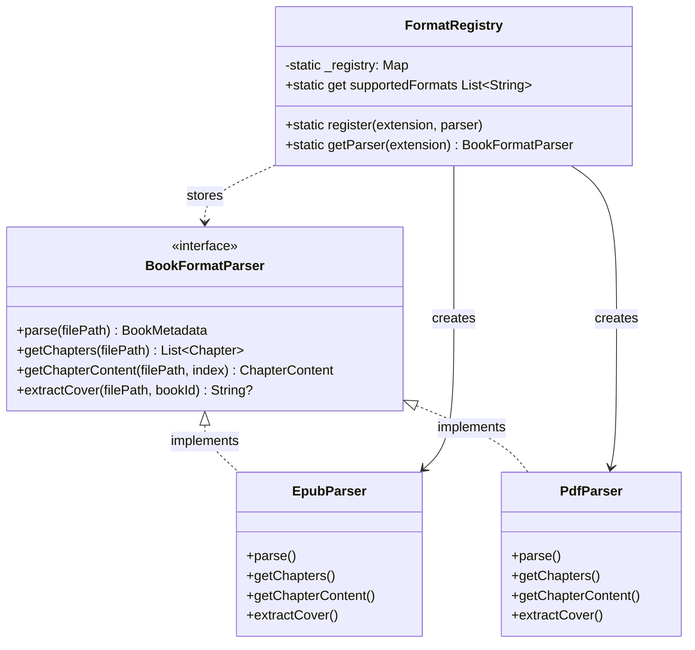
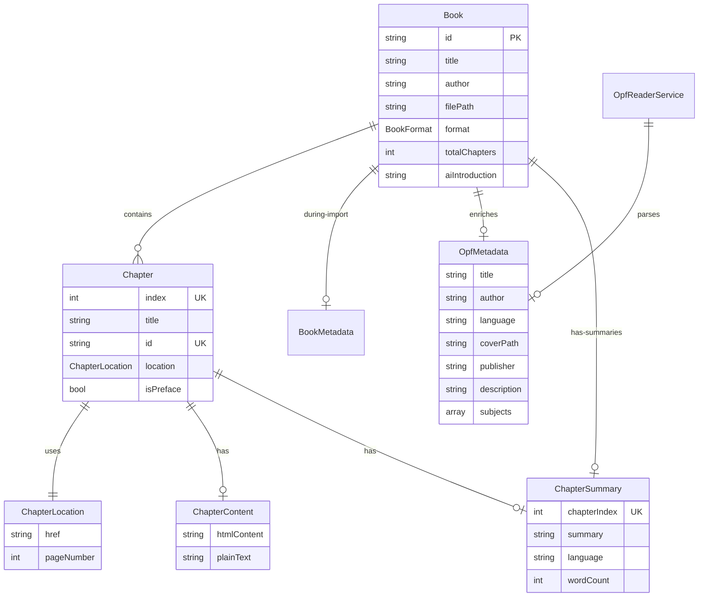

# 智读 (Zhidu) 可视化类/函数调用关系图 (Mermaid)

> **文档版本**: v2.0 | **更新日期**: 2026-05-11

---

## 一、全局架构总图



---

## 二、书籍导入流程（详细）



---

## 三、阅读流程



---

## 四、Service 核心交互关系图



---

## 五、数据库/文件持久化 UML

```mermaid
erDiagram
  SettingsService ||--|| FileStorageService : "读/写 settings.json"
  BookService ||--|| FileStorageService : "读/写 books.json + metadata.json"
  SummaryService ||--|| FileStorageService : "写 chapter-XXX-zh.md"
  TranslationService ||--|| FileStorageService : "写 chapter-XXX-en.html"

  FileStorageService ||--|| StorageConfig : "使用路径约定"

  settings_json {
    string ai_provider
    string api_key
    string model
    string base_url
    string theme_mode
    string ui_language
    string output_language
  }

  books_json {
    array Book list
  }

  Book {
    string id PK
    string title
    string author
    string filePath
    string coverPath
    string format epub_or_pdf
    string aiIntroduction
    int totalChapters
    datetime addedAt
    string language
    string publisher
    string description
    array subjects
  }

  chapter_nnn_zh_md {
    string summary_markdown
  }

  chapter_nnn_en_html {
    string translation_html
  }
```

---

## 六、AIService 内部调用链



---

## 七、并发控制机制



---

## 八、设置响应式更新流程（ValueNotifier）



---

## 九、UI 导航层级结构



---

## 十、格式解析器架构（策略+注册表）



---

## 十一、数据模型关系图



---

## 更新记录

| 日期 | 更新内容 |
|------|----------|
| 2026-05-11 | 完整 Mermaid 可视化：全局架构图、导入/阅读/翻译流程图、Service交互图、并发控制图、ValueNotifier数据流图、导航图、解析器架构图、数据模型ER图 |