# 智读 (ZhiDu) - 可视化函数调用关系图

本文档使用可视化图表展示智读应用的函数调用关系，从main入口开始，通过调用关系或功能操作关系连接各个类和函数。

## 1. 应用架构总览图

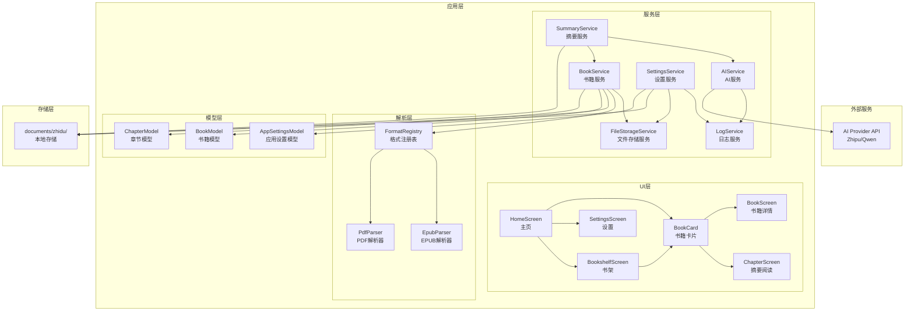

## 2. 启动流程图

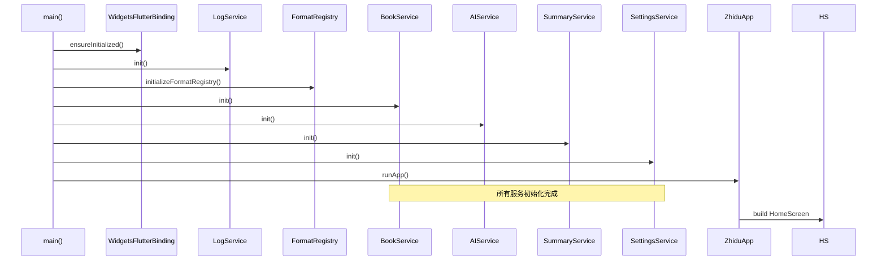

## 3. 书籍导入流程图

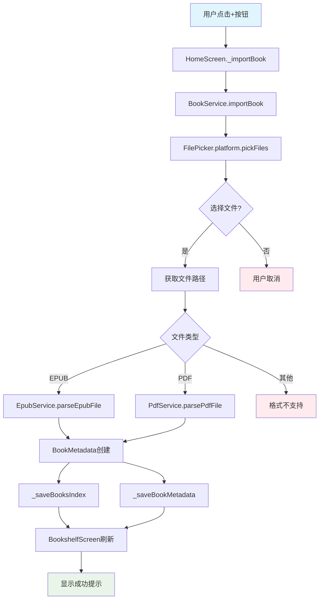

## 4. 服务层依赖关系图

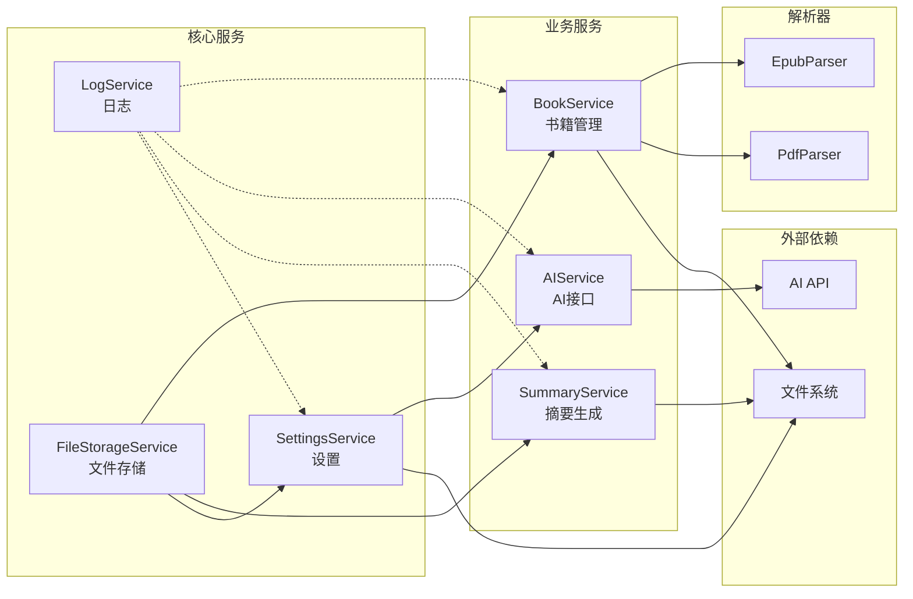

## 5. UI层交互流程图

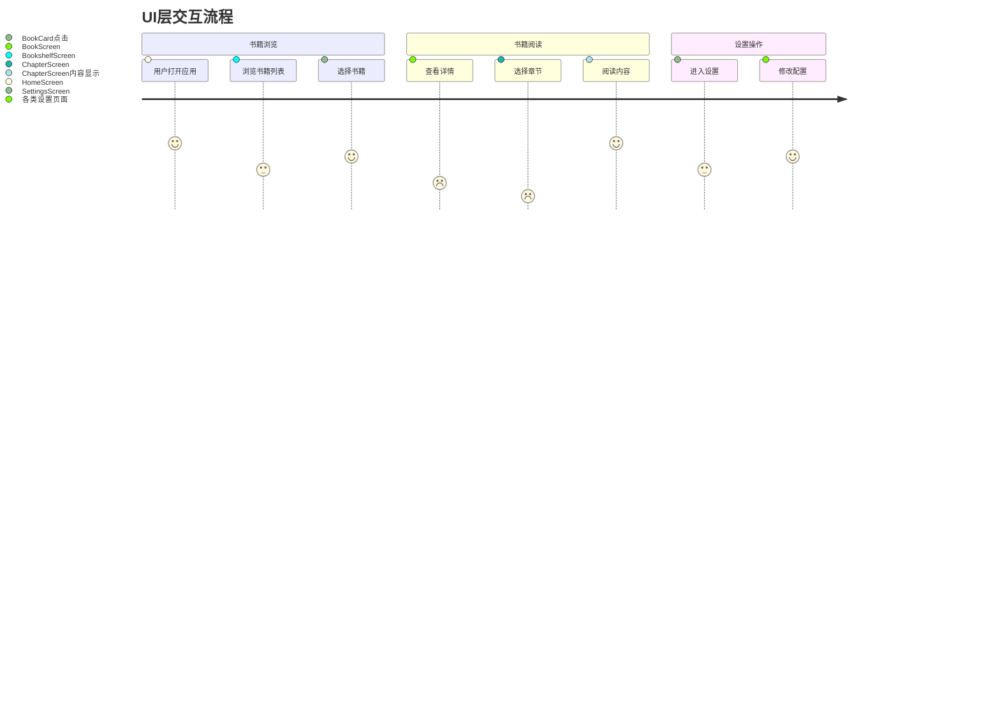

## 6. AI摘要生成流程图

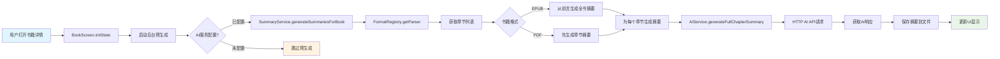

## 7. 设置变更传播图

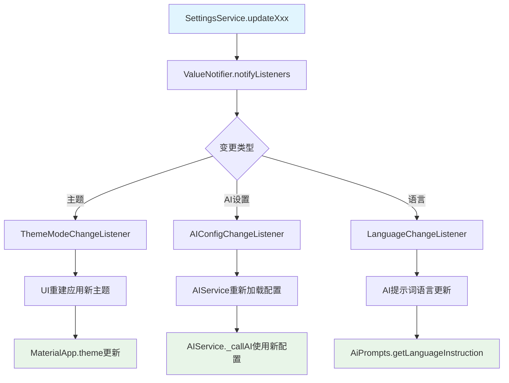

## 8. 并发控制机制图

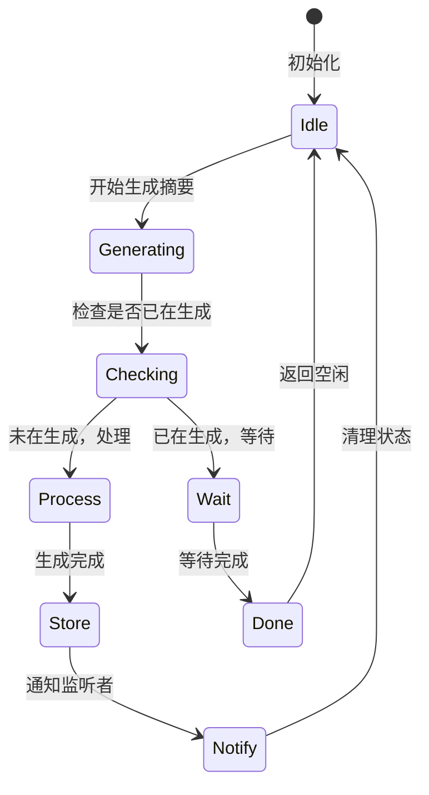

## 9. 数据流图

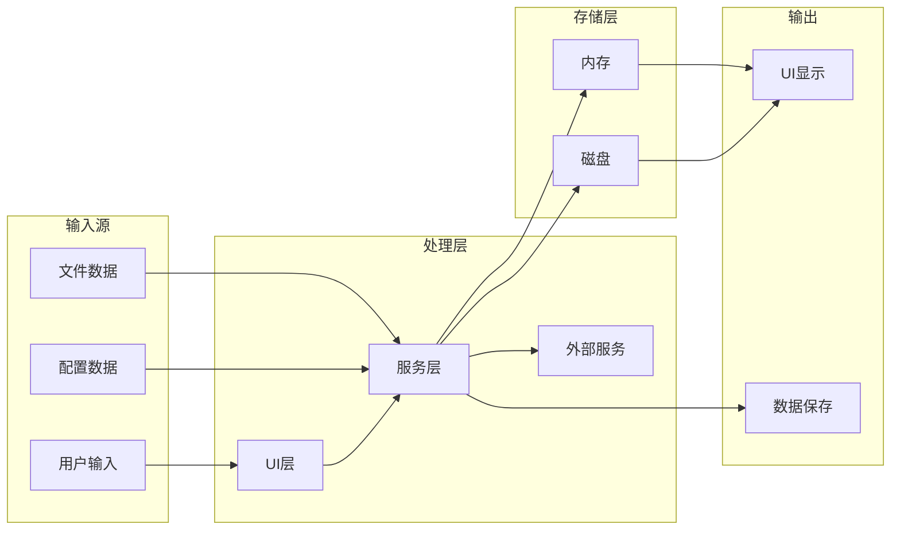

## 10. 错误处理流程图

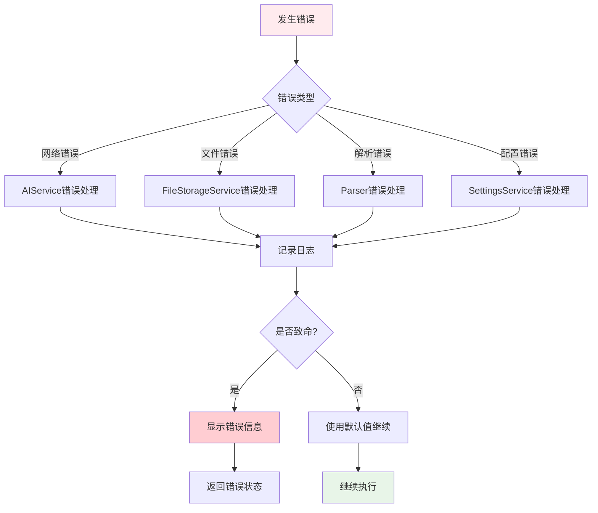

## 11. 架构分层图

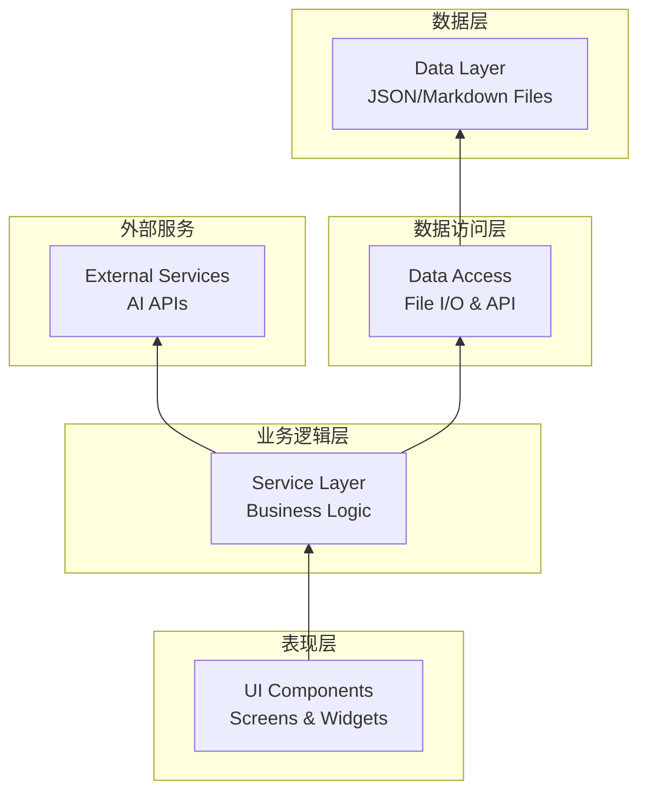

## 12. 组件交互矩阵

| 组件 | 调用 | 被调用 | 依赖 | 被依赖 |
|------|------|--------|------|--------|
| HomeScreen | BookService | - | - | LogService |
| BookService | FileStorageService | HomeScreen | FormatRegistry | LogService |
| AIService | HTTP Client | SummaryService | SettingsService | LogService |
| SummaryService | AIService | UI Components | BookService | - |
| SettingsService | FileStorageService | All Services | - | LogService |

## 13. 关键路径分析

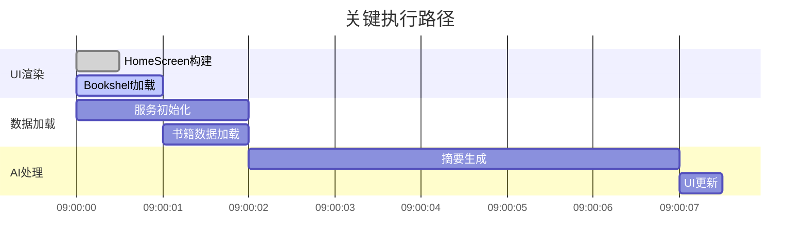

这些可视化图表全面展示了智读应用的函数调用关系，从应用启动到用户交互再到数据处理的完整流程。